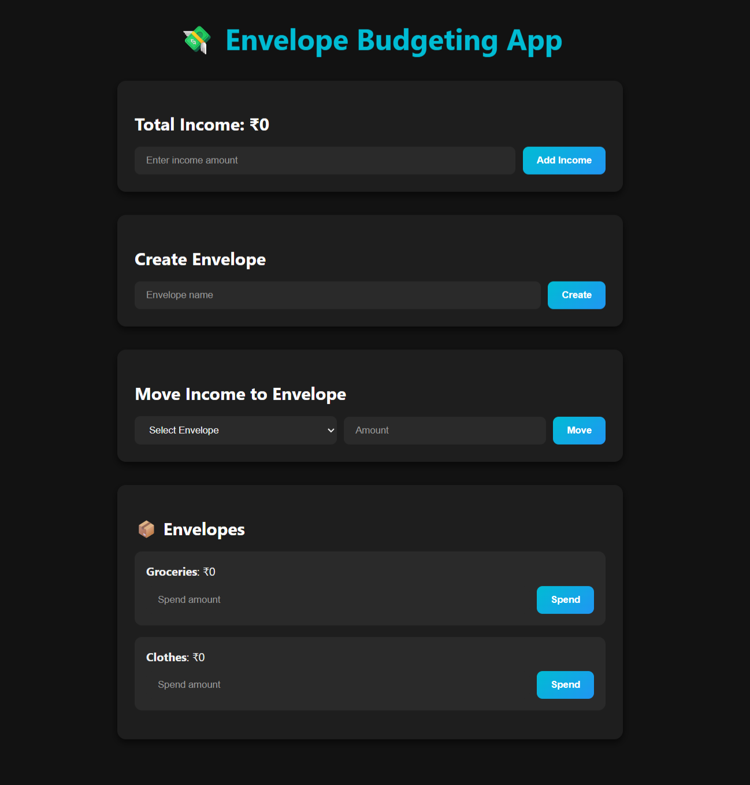

# 💸 Envelope Budgeting App

A full-stack MERN (MongoDB, Express, React, Node.js) application for personal finance management using the envelope budgeting method. This app allows users to manage their income by allocating funds into different spending categories, known as "envelopes".

## ✨ Features

-   **Add Income:** Record your total income.
-   **Create Envelopes:** Create different spending categories (e.g., Groceries, Rent, Entertainment).
-   **Distribute Funds:** Allocate parts of your income to different envelopes.
-   **Track Spending:** Record expenses from each envelope and see the remaining balance.

## 📸 Screenshots


## 🛠️ Tech Stack

-   **Frontend:** React, Axios
-   **Backend:** Node.js, Express.js
-   **Database:** MongoDB with Mongoose
-   **Styling:** CSS

## 🚀 Getting Started

Follow these instructions to get a copy of the project up and running on your local machine for development and testing purposes.

### Prerequisites

Make sure you have the following installed on your system:
-   [Node.js](https://nodejs.org/en/) (v18 or newer recommended)
-   [npm](https://www.npmjs.com/) (comes with Node.js)
-   [MongoDB](https://www.mongodb.com/try/download/community) (make sure the server is running)

### Installation & Setup

1.  **Clone the repository:**
    ```sh
    git clone https://github.com/your-username/envelope-budget-app.git
    cd envelope-budget-app
    ```

2.  **Set up the Backend:**
    -   Navigate to the backend directory:
        ```sh
        cd backend
        ```
    -   Install dependencies:
        ```sh
        npm install
        ```
    -   Create a `.env` file in the `backend` directory and add your MongoDB connection string. You can name the database whatever you like; `envelope-budget` is a good choice.
        ```env
        MONGO_URI=mongodb://localhost:27017/envelope-budget
        ```
    -   Start the backend server:
        ```sh
        npm run dev
        ```
    The server will start on `http://localhost:4000`.

3.  **Set up the Frontend:**
    -   Open a **new terminal window** and navigate to the frontend directory from the root of the project:
        ```sh
        cd frontend
        ```
    -   Install dependencies:
        ```sh
        npm install
        ```
    -   Start the frontend development server:
        ```sh
        npm start
        ```
    The application will automatically open in your default browser at `http://localhost:3000`.

